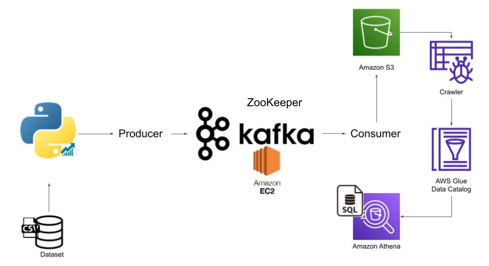

# yasminetika01-KAFKA-REAL-TIME-STOCK-MARKET-DATA-ANALYSIS-PIPELINE-AWS

This project showcases the design and implementation of a robust real-time stock market data analysis pipeline. The pipeline is powered by Apache Kafka producers and consumers, hosted on an AWS EC2 instance, to efficiently handle data streaming. The architecture orchestrates seamless data flow through Kafka, ensuring efficient cluster coordination with ZooKeeper. Critical information is optimally stored and retrieved in Amazon S3, contributing to streamlined data storage.

## Architecture 

## Technologies Used
- Programming Language - Python
- Amazon Web Service (AWS)
1. S3 
2. Athena
3. Glue Crawler
4. Glue Data Catalog
5. EC2
- Apache Kafka
- Apache ZooKeeper

